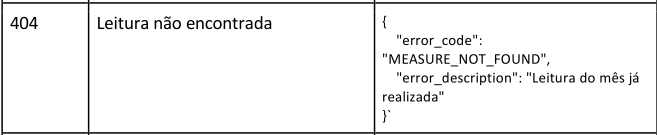

# Shopper - teste técnico 1 (Backend)

## Instalação

Basta rodar o comando:

```bash
docker compose up -d
```  

O Docker irá baixar as imagens e criar os contêineres:
- Node 18, 
- Postgres,
- Adminer (apenas para conferência dos registros)  

Em seguida, irá configurar o ambiente de desenvolvimento: 
- Baixar as dependências com o NPM
- Criar o banco de dados
- aplicar as migrations

Finalmente, rode o projeto com o comando:
```bash
npm run start
```

Isso fará o npm rodar o projeto dentro do contêiner, na porta **3000**; 
> OBS.: não execute o comando `npm run dev`, pois ele deve ser executado apenas em um terminal *"attachado"* ao contêiner

Agora é só enviar as requisições para http://127.0.0.1:3000  
Para verificar os dados no banco de dados pelo Adminer, acesse [http://172.0.0.1:8080](http://172.0.0.1:8080) e utilizar o servidor **shopper-postgres**, usuário **postgres** e senha **postgres**

Detalhes:
- alguns valores, como **DATABASE_URL** (para configurar o Postgres) e outras, deveriam ficar no arquivo .env, mas eu fiquei na dúvida se esses valores seriam criados no teste, pois foi informado que será criado um .env automaticamente, então optei por deixar essas constantes nos arquivos em que são usadas, para garantir.
- no documento do teste, para um dos erros da rota PATCH, consta o seguinte:  

Acredito que a mensagem correta seria:
    > "error_description": "Leitura não encontrada"  

    Mas, para seguir à risca a documentação, deixei como solicitado, pois não sei como os testes automatizados verificarão o retorno nesse caso. Aqui, o certo seria conversar com o responsável pela documentação para que alterasse a regra de negócio.
